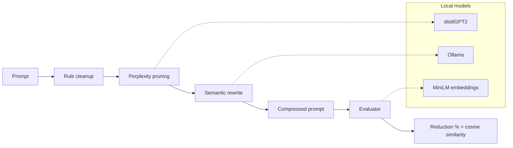

# Token Optimizer

Local multi-stage **prompt compression** pipeline. Shrinks prompts before they hit a paid API, then scores token reduction against semantic drift.

Compression runs fully local: `distilgpt2` for pruning, Ollama for rewrite, `all-MiniLM-L6-v2` for similarity.

## Architecture



```
Prompt
  │
  ├─► rule_cleanup          strip filler / normalize whitespace
  ├─► perplexity_pruning    drop low-surprisal words (distilGPT2)
  ├─► semantic_rewriter     Ollama rewrite (reject if longer or drifted)
  │
  ▼
Compressed prompt ──► evaluator (tiktoken + embedding cosine)
```

Benchmark compares four strategies: each stage alone, plus the full hybrid above.

## Setup

Python 3.12+, [uv](https://docs.astral.sh/uv/), [Ollama](https://ollama.com/).

```bash
uv sync --locked
ollama pull qwen2.5:3b          # default rewrite model in config.py
```

## Run

```bash
uv run python main.py           # demo one prompt through the hybrid pipeline
uv run python benchmark.py      # compare strategies → results/benchmark.csv
```

Change the rewrite model in `config.py` (`OLLAMA_MODEL`), then re-run the benchmark.

## Tests

```bash
uv run pytest tests/ -v
uv run pytest tests/test_perplexity_pruning.py -v   # one file
uv run pytest -k negation -v                        # filter by name
```

CI runs the full suite on every push/PR to `main` (`.github/workflows/ci.yml`).

## Strategies

| Strategy | Stages |
|----------|--------|
| `rule_only` | rule cleanup |
| `perplexity_only` | distilGPT2 pruning (`TARGET_RATIO = 0.7`) |
| `rewrite_only` | Ollama rewrite |
| `hybrid` | all three in order |

Prompts: `benchmark_prompts.py` (verbose, terse, few-shot, placeholders, negations, code, long-context).

## Results

Mean reduction / embedding similarity over 20 prompts × 4 strategies (`results/`):

| Rewrite model | rule_only | perplexity_only | rewrite_only | **hybrid** |
|---------------|-----------|-----------------|--------------|------------|
| Qwen 2.5 3B | 2.2% / 0.99 | 26.6% / 0.91 | 12.4% / 0.94 | **35.7% / 0.89** |
| Qwen 2.5 8B | 2.2% / 0.99 | 26.6% / 0.91 | 8.9% / 0.96 | **30.7% / 0.89** |
| Gemma 4B | 2.2% / 0.99 | 26.6% / 0.91 | 13.9% / 0.96 | **36.0% / 0.87** |

- Hybrid beats any single stage on reduction.
- Most savings come from perplexity pruning; rule cleanup alone is ~2% on this set.
- Larger rewrite models compress less and keep slightly higher similarity.

## Directory tree

```
token-optimizer/
├── main.py
├── benchmark.py
├── benchmark_prompts.py
├── pipeline.py
├── evaluator.py
├── interfaces.py
├── config.py
├── tokenizer_utils.py
├── pyproject.toml
├── uv.lock
├── README.md
├── .github/
│   └── workflows/
│       └── ci.yml
├── stages/
│   ├── rule_cleanup.py
│   ├── perplexity_pruning.py
│   └── semantic_rewriter.py
├── tests/
│   ├── conftest.py
│   ├── test_rule_cleanup.py
│   ├── test_perplexity_pruning.py
│   ├── test_semantic_rewriter.py
│   ├── test_evaluator.py
│   └── test_tokenizer_utils.py
└── results/
    ├── benchmark_qwen_3b.csv
    ├── benchmark_qwen_8b.csv
    └── benchmark_gemma_4b.csv
```

## Notes

- Surprisal ≠ importance — rare/noisy tokens can survive pruning.
- Rewrite rejects empty, non-shorter, or cosine &lt; 0.7 outputs.
- First run downloads Hugging Face models; Ollama models are pulled separately.
- Knobs: `TARGET_RATIO`, `OLLAMA_MODEL`, `PROTECTED_WORDS` / `PROTECTED_PATTERNS` in `config.py`.
